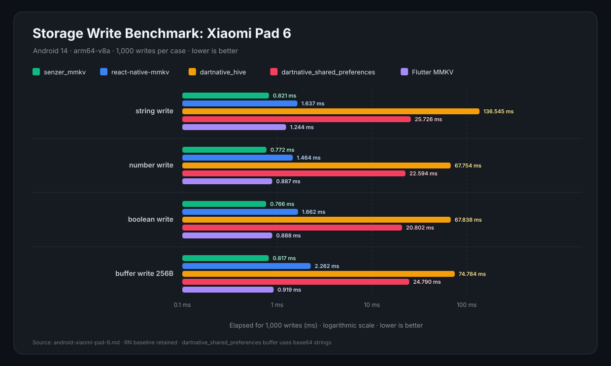

# Senzer DartNative community plugins

Public, app-agnostic DartNative plugins. This repository is independent from
Senzer products, services, credentials, and private assets.

## Packages

| Package | Description |
| --- | --- |
| [`senzer_mmkv`](packages/senzer_mmkv) | Synchronous, C++-backed MMKV-compatible storage for iOS and Android |

## Android benchmark

Release measurements were taken on an **Android Xiaomi Pad 6** (Android 14,
`arm64-v8a`) with 1,000 operations per case, two warm-up rounds, and seven
measured rounds. The table below shows the median `string write` throughput;
the full read/write table is in the [benchmark document](docs/benchmarks/android-xiaomi-pad-6.md).

  

The React Native comparison used a fresh React Native `0.87.1` TypeScript app,
`react-native-mmkv` `4.3.2`, and `react-native-nitro-modules` `0.37.1`. Its
rows are a recorded baseline; it was not rerun during the final hot-path
optimization. Hive and SQLite are comparison-only dependencies of the example
app, never dependencies of `senzer_mmkv`.

## Repository rules

This is a public repository. Do not add credentials, device serials, private
endpoints, proprietary assets, or Senzer application code. Native third-party
licensing is documented in
[`packages/senzer_mmkv/THIRD_PARTY_NOTICES.md`](packages/senzer_mmkv/THIRD_PARTY_NOTICES.md).

## License

The repository and Dart wrapper are MIT-licensed. Tencent MMKV Core remains
under its BSD 3-Clause license.
