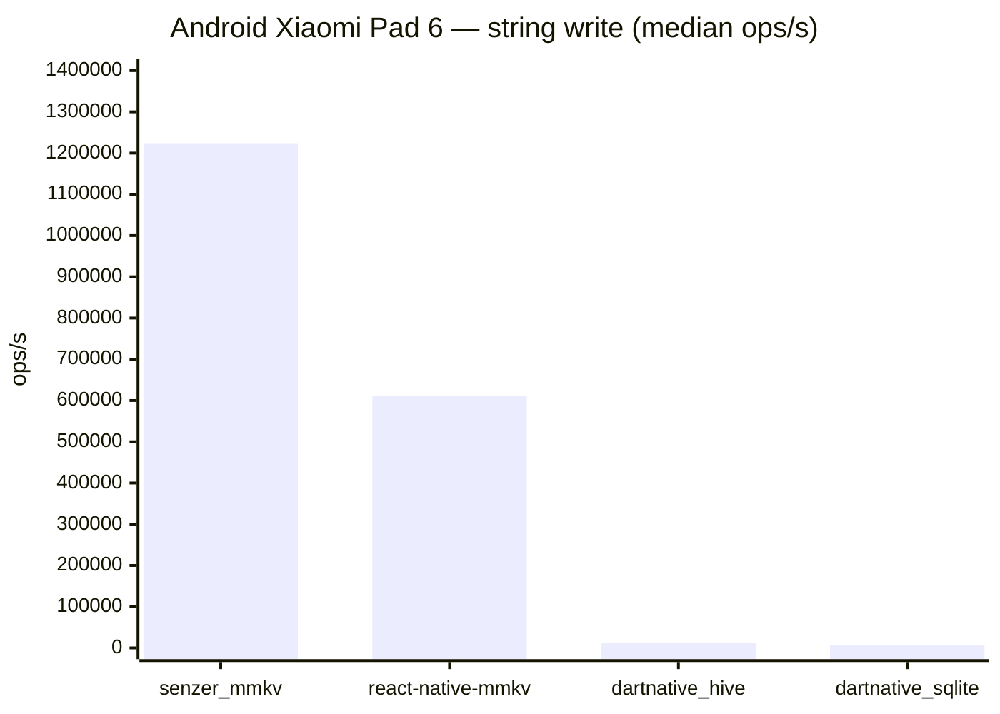

# Senzer DartNative community plugins

Public, app-agnostic DartNative plugins with a focus on native performance and
small, stable C ABIs. This repository is intentionally independent of Senzer
products, services, credentials, and private model assets.

## Packages

| Package | Purpose |
| --- | --- |
| [`senzer_mmkv`](packages/senzer_mmkv) | Synchronous, Tencent MMKV Core-backed storage with AES encryption for DartNative |

Packages are designed for `dn pub get` and generated
`DartNativePluginRegistrant` registration. Native code is shared between iOS
and Android where possible; platform adapters only provide lifecycle and
sandbox paths.

`senzer_mmkv` does not set an Android `abiFilters` restriction: the package is
built for the host app's supported Android ABIs (including `armeabi-v7a`,
`arm64-v8a`, and `x86_64`). The `arm64-v8a` setting below applies only to the
React Native comparison APK. SQLite and Hive are benchmark-only app
dependencies and are not dependencies of `senzer_mmkv`.

```bash
cd packages/senzer_mmkv
dn pub get
dn analyze
dn test
```

## Scope and compatibility

The repository is community-maintained and uses no Senzer application data.
Each package documents its compatibility and known limitations in its own
README. New packages should use an MIT, BSD-3-Clause, or Apache-2.0 license and
must not bundle secrets or private service endpoints.

## Android benchmark

The storage comparison below was measured on an **Android Xiaomi Pad 6**
(Android 14, `arm64-v8a`) using release builds. It runs 1,000 operations per
case, with two warm-up rounds and seven measured rounds; the chart shows the
median throughput for the representative `string write` case.



The React Native comparison uses a fresh React Native `0.87.1` TypeScript app
with `react-native-mmkv` `4.3.2` and `react-native-nitro-modules` `0.37.1`.
The React Native rows are the previously recorded baseline; React Native was
not rerun during the native hot-path optimization. The complete read/write
results for strings, numbers, booleans, and 256-byte buffers are in the
[detailed benchmark table](docs/benchmarks/android-xiaomi-pad-6.md).
